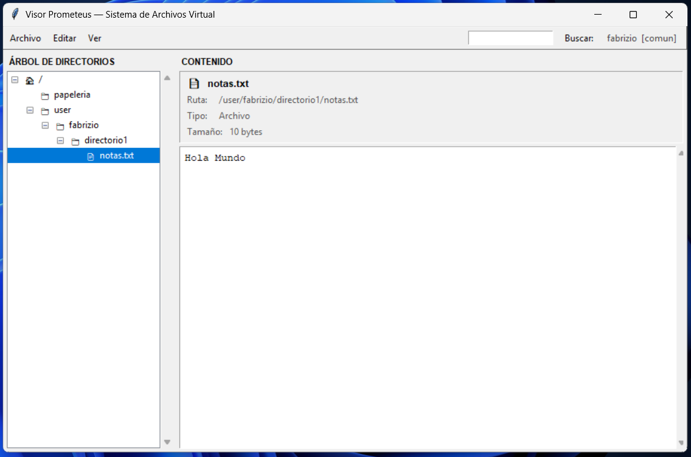

# 🗂️ Proyecto Prometeus — Sistema de Archivos Virtual en Memoria

> Un mini sistema de archivos jerárquico construido desde cero en **C**, con autenticación de usuarios, control de permisos por rol y persistencia en disco.

[](https://en.wikipedia.org/wiki/C11_(C_standard_revision))
[](#-compilación-y-ejecución)
[](#-compilación-y-ejecución)
[](#)

---

## 📖 Descripción

**Proyecto Prometeus** simula, a nivel de software, el comportamiento de un sistema de archivos real: permite **crear, leer, escribir, listar y eliminar** archivos y directorios, todo organizado en una **estructura de árbol** que vive completamente en memoria durante la ejecución.

El proyecto va más allá de un simple ejercicio de árboles en C: incorpora una capa de **autenticación**, un esquema de **roles y permisos** (administrador / usuario común) y un mecanismo de **persistencia binaria**, de modo que el estado del sistema de archivos y los usuarios registrados se conservan entre una ejecución y otra.

---

## 🖼️ Vista previa

<p align="center">
  
</p>

> El **Visor Prometeus** muestra en tiempo real el árbol de directorios y el contenido de los archivos, sincronizándose automáticamente con el sistema en C a través de `data/snapshot.txt`.

---
 
## ✨ Características principales
 
- 🌳 **Árbol de nodos en memoria** — cada directorio y archivo es un `Nodo` enlazado dinámicamente a sus hijos y a su padre.
- 🔐 **Sistema de autenticación** — inicio de sesión y registro de usuarios mediante claves de acceso diferenciadas para `admin` y `usuario común`.
- 🛂 **Control de permisos por rol** — los administradores tienen acceso total; los usuarios comunes solo pueden operar dentro de su propio directorio personal (su "home").
- 💾 **Persistencia en disco** — usuarios y sistema de archivos se serializan en archivos binarios (`data/usuarios.dat`, `data/filesystem.dat`), por lo que el estado sobrevive entre sesiones.
- 🖥️ **Shell interactiva** — una consola de comandos al estilo Unix, con prompt dinámico, colores ANSI y manejo de errores.
- 🧩 **Código modular** — cada responsabilidad (nodos, usuarios, autenticación, permisos, utilidades) vive en su propio módulo `.c` / `.h`.
- 🌐 **Multiplataforma** — el `Makefile` detecta el sistema operativo y genera el binario adecuado para Windows o Linux/Unix.
---
 
## 🖥️ Comandos disponibles
 
Una vez autenticado, el usuario entra a una shell interactiva con los siguientes comandos:
 
| Comando | Descripción |
|---|---|
| `ls [ruta]` | Lista el contenido de un directorio |
| `cd <ruta>` | Cambia el directorio actual |
| `mkdir <nombre>` | Crea un nuevo directorio |
| `touch <nombre>` | Crea un archivo vacío |
| `write <archivo> "texto"` | Escribe (sobrescribe) contenido en un archivo |
| `cat <archivo>` | Muestra el contenido de un archivo |
| `rm <ruta>` | Elimina un archivo o directorio (recursivamente) |
| `pwd` | Muestra la ruta absoluta actual |
| `whoami` | Muestra información del usuario autenticado |
| `clear` | Limpia la pantalla |
| `help` | Muestra la lista de comandos disponibles |
| `logout` / `exit` | Guarda el estado y cierra la sesión |
 
---
 
## 🏗️ Arquitectura del proyecto
 
```
Proyecto_Prometeus_fw/
├── main.c                  # Punto de entrada: menú de login/registro y shell de comandos
├── include/                # Cabeceras (.h) de cada módulo
│   ├── nodo.h              # Estructura del árbol de archivos/directorios
│   ├── filesystem.h        # Operaciones del sistema de archivos (mkdir, ls, cat, etc.)
│   ├── usuario.h           # Estructuras de usuario y lista de usuarios
│   ├── auth.h               # Autenticación y registro
│   ├── permisos.h          # Control de acceso por rol
│   ├── persistencia.h      # Guardado/carga en disco
│   └── utils.h             # Utilidades de consola multiplataforma
├── src/                    # Implementación de cada módulo
├── data/                   # Archivos binarios de persistencia
└── Makefile                # Compilación automatizada
```
 
### El nodo, pieza central del sistema
 
```c
typedef struct Nodo {
    char nombre[MAX_NOMBRE];   // Nombre del archivo o directorio
    TipoNodo tipo;             // DIRECTORIO o ARCHIVO
    struct Nodo *padre;        // Puntero al nodo padre
    struct Nodo **hijos;       // Arreglo dinámico de hijos
    int numHijos;
    char *contenido;           // Contenido (solo si es ARCHIVO)
    int size;
} Nodo;
```
 
Cada directorio puede tener un número dinámico de hijos, y cada archivo almacena su propio contenido en memoria dinámica — replicando, a pequeña escala, la lógica de un sistema de archivos jerárquico real (similar al funcionamiento de un inodo).
 
---
 
## ⚙️ Compilación y ejecución
 
El proyecto utiliza un **Makefile multiplataforma** que detecta automáticamente el sistema operativo.
 
```bash
# Compilar
make
 
# Compilar y ejecutar directamente
make run
 
# Limpiar archivos generados
make clean
```
 
> En Windows genera `sistema.exe`; en Linux/Unix genera el ejecutable `sistema`.
 
Al ejecutarlo, el programa presenta un menú de **inicio de sesión / registro**. Tras autenticarse, se accede a la shell interactiva descrita arriba.
 
---
 
## 👥 Roles de usuario
 
| Rol | Alcance |
|---|---|
| **Administrador** | Acceso total a todo el árbol del sistema de archivos |
| **Usuario común** | Acceso restringido únicamente a su directorio personal y sus subdirectorios |
 
El registro de nuevos usuarios solicita una clave de acceso que determina con qué rol queda asociada la cuenta.
 
---
 
## 🎓 Contexto académico
 
Proyecto desarrollado para el curso de **Lenguaje de Programación I**, cuyo objetivo es aplicar estructuras de árbol, manejo de memoria dinámica y modularidad en C para construir un sistema de archivos funcional.
 
### Integrantes
 
- Flores Zambora, Airthon Daniel
- Gamarra Cure, Jeferson Fabian
- Cuello Inche, Manuel Benito
- Luna Roca, Fabrizio Santiago
---
 
<p align="center">Hecho con 🧠 y muchas horas de debugging en C.</p>
